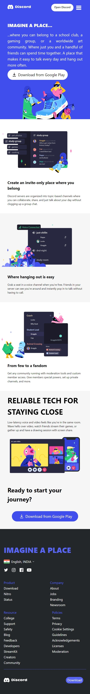
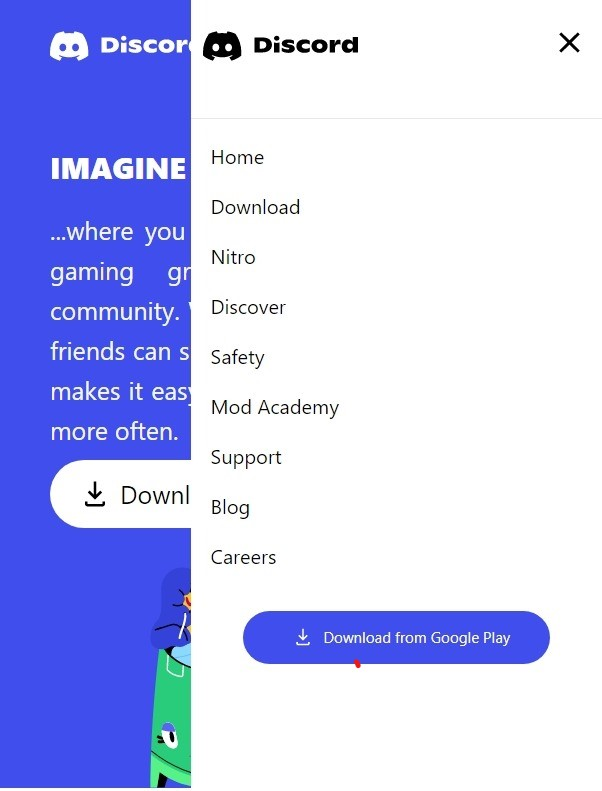
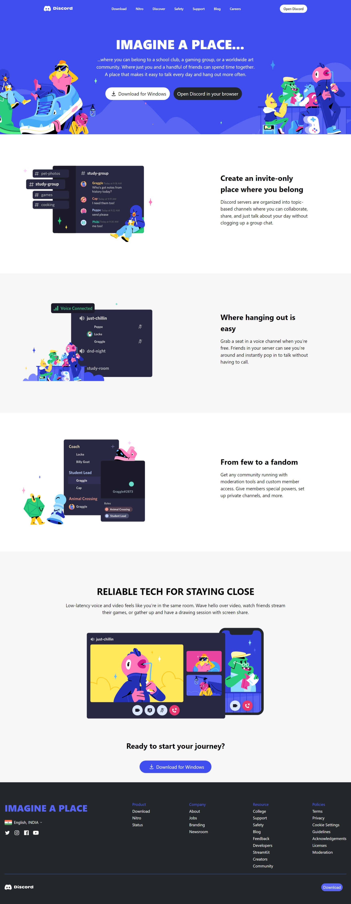

# CLONE OF DISCORD HOMEPAGE 

 This project is made for the problem statement given by the Ineuorn.ai during their hiring process for the position of Software Trainee Engineer.


# Take a look

## I have designed the page for two screen sizes- 
1. Small Screen Size Devices (min-640px) - Mobile

2. Large Screen Size Devices (min-1024px) - Laptop


### Small Screen Size Device
---



### Collapsible Menu for Mobile Devices


### Large Screen Size Device



<br/>
<br/>

## To run the webpage in your local computer :
1. Clone the project in your device by using - 
    ```
    git clone
    ```

2. You need an internet connection for using Tailwind CSS.

3. Copy the path of the `.html` in your browser or You can use the `live-server` extension while opening the project via visual studio code.